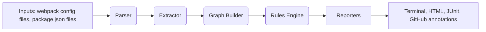

# Architecture

`mfe-doctor` is designed as a pipeline of independent layers.

## Layers

- **Inputs**: webpack config files and `package.json` files.
- **Parser**: reads config files and builds a syntax tree.
- **Extractor**: finds `ModuleFederationPlugin` declarations and extracts `shared`, `exposes`, and `remotes` entries.
- **Graph Builder**: organizes the host, remotes, and shared package declarations into a common graph.
- **Rules Engine**: executes each independent rule against the graph and parsed configs.
- **Reporters**: render output in terminal, HTML, CI-friendly XML, or GitHub Action annotation format.

## Why Rule-based extensibility

The `Rule` interface is the extensibility point. Each rule is an independent module with a shared contract:

- `id`
- `severity`
- `description`
- `check(context)`

This means adding a rule should require only a new file plus tests and docs. No changes to the core engine should be necessary.

## Design principles

- Keep the scope narrow: only Module Federation config issues.
- Use clear data types in `src/core/types.ts`.
- Preserve compatibility with Webpack 5 CJS and ESM configs.
- Keep reporters separate from rule logic.
